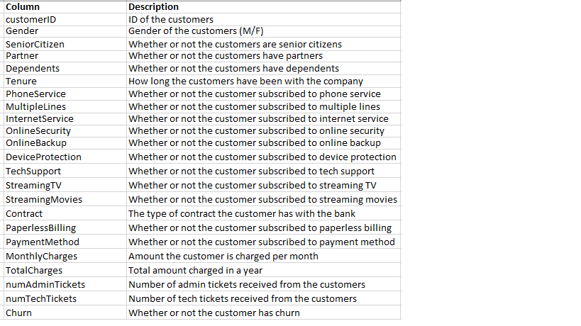
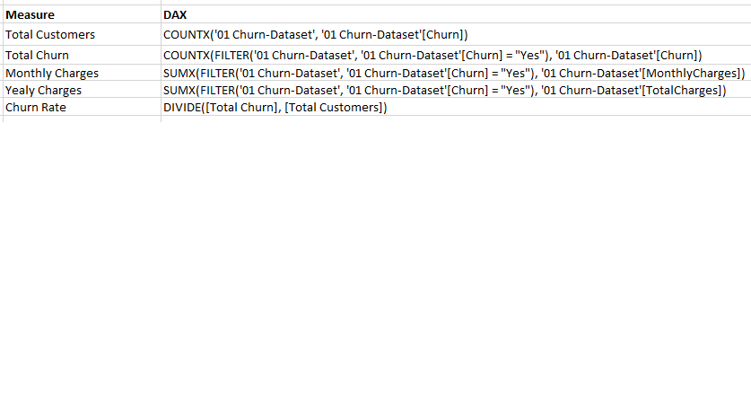
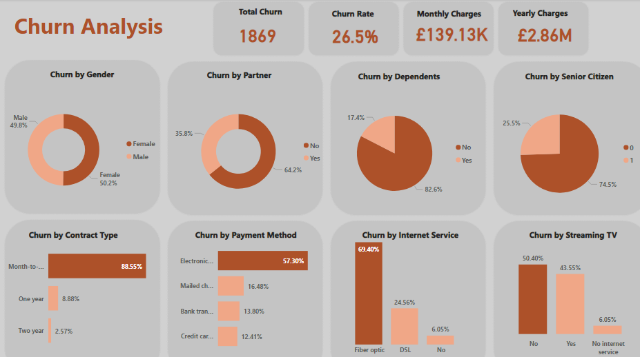

# Phone-Now-Churn-Analysis

## Introduction
**Phone Now** is a telecom company and the industry is hard-earned, Phone Now does not want to loose their customers. The retention department is here to get customers back in case of termination. Currently, they get in touch after they have terminated which is reactionary and would like to know more about their customers.

**_Disclaimer_**: _All datasets and report do not represent any company or organisation but just a dummy dataset to demonstrate capability of Power BI_

## Power BI Reporting Requirement
1.	Define proper KPI
2.	Create a dashboard for the retention manager reflecting the KPIs
3.	Explain findings and include suggestions of what needs to be changed
4.	
#### KPI defined in this report are:
1.	Total churn
2.	Churn Rate
3.	Total monthly charges 
4.	Total yearly charges
5.	Churn by gender
6.	Churn by partner
7.	Churn by dependents
8.	Churn by senior citizen
9.	Churn by contract type
10.	Churn by payment method
11.	Churn by internet service
12.	Churn by streaming TV
   
## Skills Demonstrated
- Problem understanding 
- Problem solving 
- Critical thinking
- Data cleaning
- Data manipulation
- Template design
- Data analysis
- Visualisation
- DAX studio
- Written communication.

## Data Sourcing
The dataset was provided in an excel workbook.

## Data Description
To show an understanding of the dataset, the data description is shown below:

## Mockup draft
Based on the report requirements, a draft of the report was thoughtful created (_shown below_) as a guide in the course of building the report.

## ETL
Power BI desktop was launched and connected to Excel workshop as that is the format of the dataset. Lots of transformation process was carried out such:
-Checked all the tables, rows and columns to ensure consistent formatting, no missing values and duplicate values. 
-Used first row as header
After these, I closed and applied settings to start analysis

## DAX measures calculations
The following measures were calculated to aid my analysis.

## Dashboard Design
The background of the dashboard was designed in power point with the mock up draft as a guide. It was saved as PNG file and imported in Power BI.

### Analysis and Visualization
Using the mockup draft and following the report requirements, I built the dashboard as required.

The interractive dashboard can be viewed [here](https://app.powerbi.com/view?r=eyJrIjoiZDdhYTIxODctYzQzZS00ZGI2LThhZDMtOGY3YTYwY2FkMzQ0IiwidCI6ImFmMWJhNzExLTA2MmMtNGYzZS04YmNjLWQyY2U4N2RjNGQwYSJ9) 

### Interpretation
-	A total of 1869 customers (26.5%) have churned accounting for a total monthly loss of £139.13K and annual loss of £2.86M
-	There is no significant difference on the gender of the customers who have churned
-	Approximately 64% of the customers who churned have partners, 83% have dependents and 75% are senior citizens
-	Month-to-month contract type makes up a whopping 89% of the customers who churned while electronic payment type makes up more than half (57%) of the customers who churned.
-	Fibre optic internet service type accounted for 69% of the customers who churned while about half of the customers who did not subscribe to streaming TV also churned.
### Recommendation
-	Increase sale of 1- and 2-year contracts by 10% each
-	Increase automatic payments by 5%
-	Increase sale of DSL internet service by 10%
-	Conduct diagnostic analysis on electronic check payment method and fibre optic internet services to determine the possible causes of the high rate of churn
-	Customers who are without partners, dependents nor senior citizens should be targeted more during advertising.
